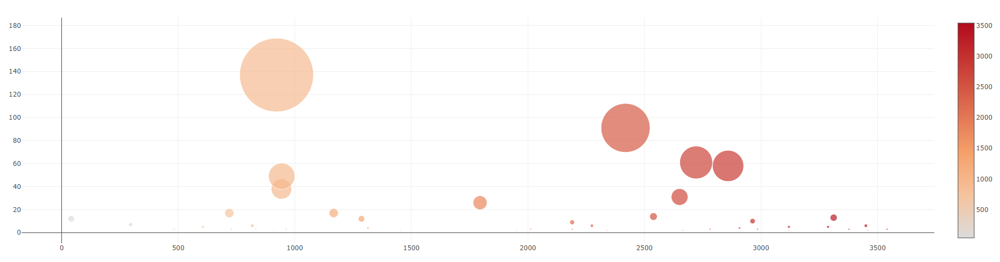

# belly_bio
Belly Button Diversity

Tools: I used JSON, SQLite, SQLalchemy, and CSV data to visualize the extensive data set. Jupyter notebook was used first for testing and trouble shooting the app before launch, but it works fine with Python as launched in Heroku as an app.

Please take a look at the app version:
https://bellybio.herokuapp.com/

Last checked July 19th, 2022. For issues with Heroku, please see https://devcenter.heroku.com/categories/reference
